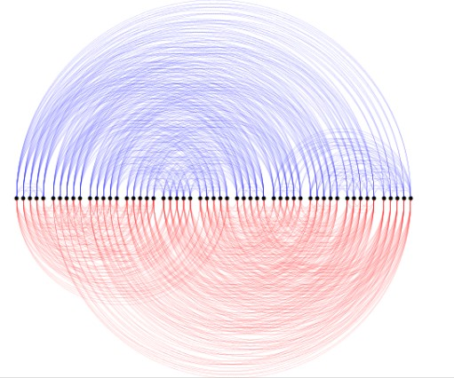
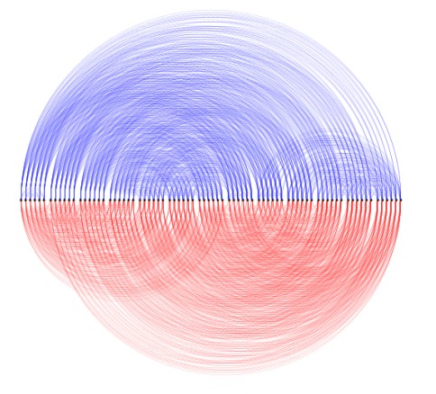

# TCC-Grafos

# Description of my TCC

Before of TCC, I worked 2 years in undergraduate research about crossing number in 2-pages of Kneser Graph K(n,2) with orientation of Professor Luerbio Faria and colaboration of Mario Valencia Pabon and Jonas Carvalho.
In this research, we built a method of drawing in 2-pages K(n,2) and drawed K(6,2) and K(8,2). We find a upper and lower bound for crossing number in 2-pages for Kneser Graph &nu;_2(K(n,2)) in case even number of vertices with asymptotic value of &Theta;(n^8) = &Theta;(|V(K(n,2))|^4) with leading term for lower bound of 2^-13 and leading term for upper bound of 2^-10 (before, the lower bound was &Omega;(n^5) asymptotic in TCC of Jonas Carvalho).

In my TCC, I find and proof a upper and lower bound of &nu;_2(K(n,2)) for odd case using the same drawing method, and proof asymptotic value of &Theta;(n^8) with leading term for lower bound of 2^-13 and leading term for upper bound of 2^-10. Finally, I proof that &nu;(K(n,2)) = &nu;_2(K(n,2)) = &Theta;(n^8) = &Theta;(|V(K(n,2))|^4) with leading term for lower bound of 2^-13 and leading term for upper bound of 2^-10 for even and odd cases. Further, I implemented 4 codes in python:

- desenho.py : calculate the &nu;_2(K(n,2)) and each of 5 crossing types, for any n using this drawing method;
- slope.py : Slope Algorithm[Klerk,Pasechnik,Salazar’2018] used in this work because give the optimal drawing in 2-pages for Complete Graph;
- berge.py : Berge Algorithm[Claude Berge’1973] that Mario Pabon introduce for create a hamiltonian cycle with separated cliques of K(n,2);
- drawing-graph-1.py : receiving as input a integer n generate automatically a image in .png with drawing of K(n,2) using this method as output;

# Table Output of desenho.py

<figure>
	
	<figcaption>Table</figcaption>
</figure>

# Images Output of drawing-graph-1.py

K(6,2)
<figure>
	
</figure>

K(7,2)
<figure>
	
</figure>

K(8,2)
<figure>
	
</figure>

K(9,2)
<figure>
	
	<figcaption>K(9,2)</figcaption>
</figure>

K(10,2)
<figure>
	
</figure>

K(11,2)
<figure>
	
</figure>

K(12,2)
<figure>
	
</figure>

K(13,2)
<figure>
	
</figure>

K(14,2)
<figure>
	
</figure>

# Links of TCC, Slides and Articles/Papers

The TCC is in link https://drive.google.com/file/d/1rdVQt4bduckDHM-4cPLVyeTVlDao-Lz0/view

Slides of TCC is in link https://drive.google.com/file/d/1VZG9J99U7KstsfIcAhQi-4EssC_GrHdH/view

Slides of apresentations of undergraduate research: 
- https://drive.google.com/file/d/1x_4KVi5Y2rs76zSf7t42swAEv_bteDaE/view
- https://drive.google.com/file/d/1JZaxvvAixB9QTqXL1o_vxD_pXkZDOOiu/view

Links of published articles/papers of undergraduate research:
- de Sousa, A. D. R., Carneiro, J., Faria, L., Pabon, M. V., Sobre o número de cruzamentos do grafo de Kneser K (n,2). In: Anais do VII Encontro de Teoria da Computação. SBC, 2022. p. 61-64. https://sol.sbc.org.br/index.php/etc/article/view/20659/204
- de Sousa, A. D. R., Carneiro, J., Faria, L., Pabon, M. V., Sobre o número de cruzamentos do grafo de Kneser K(n, 2) (resumo), II Encontro de Mulheres na Matemática, 2022. https://drive.google.com/file/d/1yC6RkN-VvT6UCCjCG6VPNgrIgQ9kVJ1z/view
- de Sousa, A. D. R., Carneiro, J., Faria, L., Pabon, M. V., How to draw a K(n,2) Kneser graph?, in Proceedings of the 10th Latin American Workshop on Cliques in Graphs - LAWCG' 22 (resumo), pp. 45. https://www.lawcg.mat.br/lawcg22/

